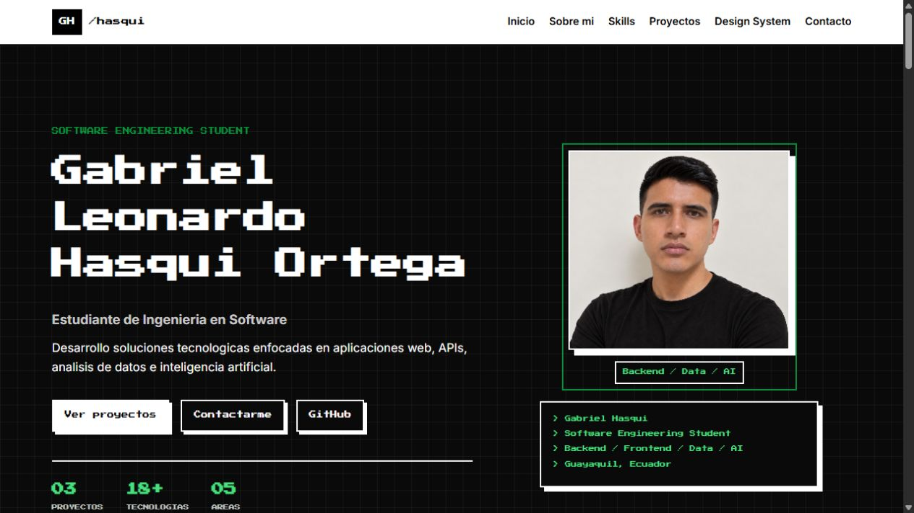

# Portafolio Gabriel Hasqui

Portafolio web personal de Gabriel Leonardo Hasqui Ortega, estudiante de Ingenieria en Software.

## Tecnologias usadas

- HTML5
- CSS3
- JavaScript
- Font Awesome

## Secciones

- Inicio
- Sobre mi
- Habilidades
- Proyectos destacados
- Design System / Componentes
- Contacto

## Funcionalidades JavaScript

- Menu responsive.
- Filtro de proyectos por categoria.
- Validacion del formulario de contacto.
- Boton para volver al inicio.

## Captura

## Como ver el proyecto

Abre el archivo `index.html` en el navegador.

Tambien puede publicarse con GitHub Pages desde la rama principal del repositorio.
